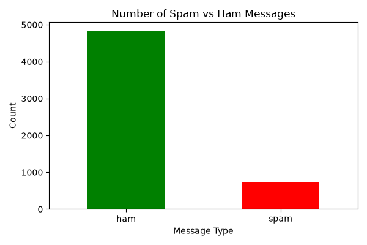
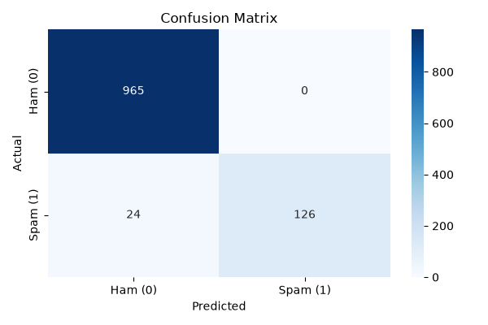

#  SMS Spam Detection

<div align="center">

### Machine Learning & Natural Language Processing

**An end-to-end NLP classification project that automatically detects whether an SMS message is legitimate or spam.**


</div>

---

##  Project Context

> **Mini Project — DevTown NLP in Python Bootcamp**
>
> **Day 5 — NLP in Python**

---

##  Problem Statement

Build a Machine Learning model capable of automatically classifying an SMS message as **Ham** or **Spam** based on its textual content.

The system is designed to:

- Analyze the SMS dataset
- Explore the distribution of spam and legitimate messages
- Transform text into machine-readable numerical features
- Train a binary classification model
- Evaluate model performance
- Predict custom SMS messages entered by the user

---

##  Project Overview

Spam detection is a practical Natural Language Processing problem where the goal is to distinguish unwanted messages from legitimate communication.

This project demonstrates a complete machine learning workflow, starting from raw SMS data and ending with an interactive prediction system.

```text
Raw SMS Data
      ↓
Data Exploration
      ↓
Text Preprocessing
      ↓
Label Encoding
      ↓
Train / Test Split
      ↓
CountVectorizer
      ↓
Logistic Regression
      ↓
Model Evaluation
      ↓
Custom SMS Prediction
```

The project focuses on applying fundamental NLP and machine learning techniques to a real-world classification problem rather than simply training a model.

---

##  Dataset

The project uses the **SMS Spam Collection Dataset**.

**Source:** [SMS Spam Collection Dataset — Kaggle](https://www.kaggle.com/datasets/uciml/sms-spam-collection-dataset)

| Property | Details |
|---|---|
| Total Messages | **5,572** |
| Classes | **Ham / Spam** |
| Input | SMS Message |
| Task | Binary Classification |
| Data Type | Natural Language Text |

### Target Classes

| Label | Meaning |
|---|---|
| 🟢 `ham` | Normal / legitimate SMS |
| 🔴 `spam` | Unwanted / promotional / suspicious SMS |

---

##  Exploratory Data Analysis

Before training the model, the dataset is explored to understand its structure and characteristics.

The analysis includes:

- Dataset dimensions
- Column inspection
- Missing-value analysis
- Class distribution
- Spam vs. Ham comparison
- Basic text exploration

Understanding the class distribution is important because spam datasets typically contain significantly more legitimate messages than spam messages.

---

##  Data Preprocessing

The raw dataset is prepared for machine learning through several preprocessing steps.

### Label Encoding

The categorical target variable is converted into numerical values:

```text
Ham  → 0
Spam → 1
```

### Train-Test Split

The dataset is divided into:

```text
80% → Training Data
20% → Testing Data
```

The training data is used to learn patterns from SMS messages, while the testing data is used to evaluate the model on unseen messages.

---

##  Feature Engineering

Machine learning algorithms cannot directly understand raw text.

To convert SMS messages into numerical features, the project uses **CountVectorizer**.

### CountVectorizer

CountVectorizer implements a **Bag-of-Words** representation by creating a vocabulary from the SMS messages and representing each message using word-frequency features.

English stopwords are removed during feature extraction to reduce unnecessary features.

```text
SMS Message
     ↓
Tokenization
     ↓
Stopword Removal
     ↓
Vocabulary Creation
     ↓
Word Frequency
     ↓
Numerical Feature Matrix
```

This converts the natural-language messages into a sparse numerical matrix that can be processed by the classification algorithm.

---

##  Machine Learning Model

### Logistic Regression

The project uses **Logistic Regression** as the classification algorithm.

Logistic Regression is a strong baseline for text classification because it works efficiently with high-dimensional sparse feature matrices and provides a straightforward approach to binary classification.

### Why Logistic Regression?

- Fast training
- Efficient with sparse text features
- Strong baseline for NLP classification
- Suitable for binary classification
- Simple and interpretable
- Works well with Bag-of-Words representations

---

##  Model Configuration

| Component | Technology / Method |
|---|---|
| Problem Type | Binary Classification |
| Algorithm | Logistic Regression |
| Feature Extraction | CountVectorizer |
| Feature Representation | Bag of Words |
| Stopwords | English Stopwords Removed |
| Training Split | 80% |
| Testing Split | 20% |
| Evaluation | Accuracy + Confusion Matrix |

---

##  Model Performance

The model achieved approximately:

# **97.85% Accuracy**

| Metric | Result |
|---|---:|
| Accuracy | **≈ 97.85%** |
| Correct Predictions | **1,091** |
| Test Samples | **1,115** |

The result demonstrates that traditional machine learning techniques combined with basic NLP feature engineering can provide strong performance on SMS spam classification.

> **Note:** Accuracy alone does not provide the complete picture for classification problems. Precision, recall, F1-score, and class-specific error analysis would be useful additions for a production-grade evaluation.

---

##  Visualizations

### Spam vs. Ham Distribution

The project visualizes the distribution of legitimate and spam messages to understand the class balance within the dataset.



### Confusion Matrix

The confusion matrix provides a detailed view of correct and incorrect classifications for both Ham and Spam messages.



---

## 🧪 Custom SMS Prediction

The project includes an interactive prediction feature that allows users to test their own SMS messages.

Run the application:

```bash
python spam_detection.py
```

The program will prompt:

```text
Enter an SMS message:
```

### Example — Spam

```text
Enter an SMS message: Congratulations! You have won a free prize.
```

Expected classification:

```text
SPAM MESSAGE
```

### Example — Ham

```text
Enter an SMS message: Hey, are we still meeting at 6?
```

Expected classification:

```text
HAM MESSAGE
```

This demonstrates how the trained model can be used to classify previously unseen text.

---

##  Project Structure

```text
SMS-Spam-Detection/
│
├── data/
│   └── spam.csv
│
├── images/
│   ├── spam_vs_ham.png
│   └── confusion_matrix.png
│
├── spam_detection.py
│
├── requirements.txt
│
└── README.md
```

---

## Tech Stack

### Programming Language

- Python 3.8+

### Data Analysis

- Pandas

### Machine Learning

- Scikit-learn
- Logistic Regression

### Natural Language Processing

- CountVectorizer
- Bag-of-Words
- Stopword Removal
- Text Preprocessing

### Visualization

- Matplotlib
- Seaborn

---

##  Installation

Clone the repository:

```bash
git clone <your-repository-url>
```

Navigate into the project:

```bash
cd SMS-Spam-Detection
```

Install the required dependencies:

```bash
pip install -r requirements.txt
```

---

##  How to Run

Run the main Python script:

```bash
python spam_detection.py
```

The program will:

1. Load the dataset
2. Explore the data
3. Preprocess the SMS messages
4. Encode the target labels
5. Split the dataset
6. Convert text into numerical features
7. Train the Logistic Regression model
8. Generate predictions
9. Evaluate model performance
10. Display the confusion matrix
11. Allow custom SMS classification

---

## ✅ Tasks Completed

- [x] Loaded the SMS Spam Collection dataset
- [x] Explored the dataset
- [x] Analyzed Spam vs. Ham distribution
- [x] Encoded categorical labels
- [x] Split data into training and testing sets
- [x] Preprocessed SMS text
- [x] Removed English stopwords
- [x] Implemented CountVectorizer
- [x] Created Bag-of-Words features
- [x] Trained Logistic Regression model
- [x] Generated predictions
- [x] Evaluated model accuracy
- [x] Generated confusion matrix
- [x] Created data visualizations
- [x] Implemented custom SMS prediction

---

##  Key Concepts Demonstrated

This project demonstrates practical understanding of:

- Natural Language Processing
- Text Classification
- Exploratory Data Analysis
- Text Preprocessing
- Feature Engineering
- Bag-of-Words
- CountVectorizer
- Stopword Removal
- Binary Classification
- Logistic Regression
- Train-Test Splitting
- Model Evaluation
- Confusion Matrix
- Machine Learning Inference

---

## 🔬 End-to-End Machine Learning Workflow

```text
                ┌─────────────────┐
                │    SMS DATA     │
                └────────┬────────┘
                         ↓
                ┌─────────────────┐
                │ Data Exploration│
                └────────┬────────┘
                         ↓
                ┌─────────────────┐
                │ Preprocessing   │
                └────────┬────────┘
                         ↓
                ┌─────────────────┐
                │ Label Encoding  │
                └────────┬────────┘
                         ↓
                ┌─────────────────┐
                │ Train/Test Split│
                └────────┬────────┘
                         ↓
                ┌─────────────────┐
                │ CountVectorizer │
                └────────┬────────┘
                         ↓
                ┌─────────────────┐
                │ Logistic        │
                │ Regression      │
                └────────┬────────┘
                         ↓
                ┌─────────────────┐
                │ Model Evaluation│
                └────────┬────────┘
                         ↓
                ┌─────────────────┐
                │ Custom SMS      │
                │ Prediction      │
                └─────────────────┘
```

---

##  Future Improvements

The current project provides a strong baseline. Possible improvements include:

- [ ] Compare Logistic Regression with Multinomial Naive Bayes
- [ ] Compare Logistic Regression with Support Vector Machines
- [ ] Replace CountVectorizer with TF-IDF
- [ ] Experiment with unigram and bigram features
- [ ] Perform hyperparameter tuning
- [ ] Add precision, recall, and F1-score
- [ ] Add ROC-AUC evaluation
- [ ] Implement cross-validation
- [ ] Perform class-imbalance analysis
- [ ] Build a Streamlit web interface
- [ ] Expose the model through an API
- [ ] Experiment with transformer-based NLP models
- [ ] Deploy the classifier as a web application

---

##  Learning Outcomes

Through this project, I gained practical experience in building an end-to-end **Natural Language Processing classification pipeline**.

The project demonstrates how unstructured text can be transformed into useful machine learning features and ultimately into predictions.

```text
Raw Text
   ↓
Data Understanding
   ↓
Preprocessing
   ↓
Feature Engineering
   ↓
Model Training
   ↓
Evaluation
   ↓
Prediction
```

The main learning outcome was understanding that successful machine learning involves more than selecting an algorithm. Data exploration, preprocessing, feature engineering, evaluation, and real-world inference are equally important parts of the workflow.

---

## 🎓 Acknowledgement

This project was completed as a **Mini Project during the DevTown NLP in Python Bootcamp**.

**Bootcamp:** NLP in Python  
**Project:** Day 5 — SMS Spam Detection

Dataset:

[SMS Spam Collection Dataset — Kaggle](https://www.kaggle.com/datasets/uciml/sms-spam-collection-dataset)

<div align="center">

### ⭐ If you found this project useful, consider giving the repository a star!

</div>
````
